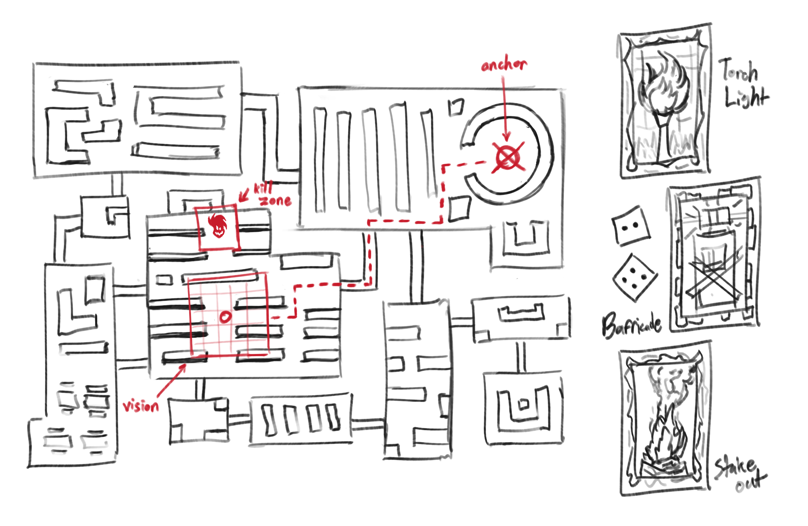
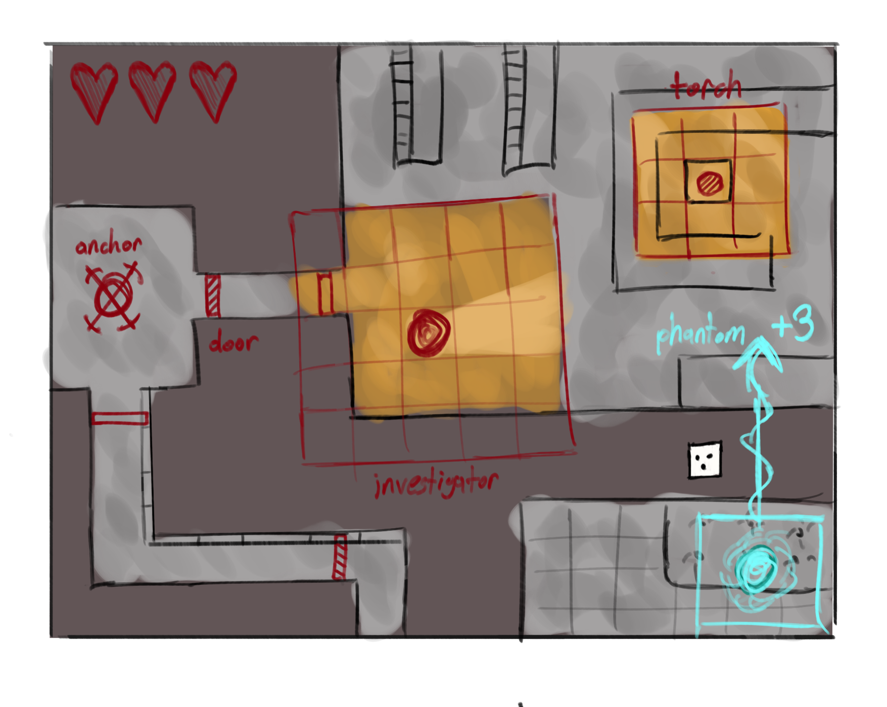

# Sightline Design Treatment

## Matthew Onorato (Spring 2026)

### Section #1: Crafting The Game Treatment
#### Title
> The title of my very own game will be called Sightline. I have dubbed it this because it suggests a certain amount of ominousness that I quite like. It is not meant to be a horror game, and given its target audience, it should not be. It should however, be spooky in theme to support the main gameplay mechanics which ultimately revolve around a match of hide and seek. Sightline not only alludes to this tone but plays into the fact that interaction between players can only take place when one has line of sight on the other. No matter the chosen role or how unique it plays, both sides have to abide by this one rule.

#### Game Setting 
> The chosen setting for my game is “The Blind Ward”. It is an abandoned institution that has decayed and fallen to ruin over many years of use. The people who inhabited it are long gone, but the ghosts of their souls still remain, tied to cursed objects that need to be cleansed. A crew of investigators would arrive on a dark stormy night looking to investigate the forgotten building. Upon entering they would see blood stained corridors, flickering emergency lights, rusted metal, broken tiles and shattered glass. Initially this game was going to take place in a foggy nighttime forest, but the existing walkways of an asylum allow me to place distinct markers so players remain on track, can be used as an excuse to compose a maze-like playable space, and overall plays into the inherent hide and seek nature of the game.

#### Game Characters
> On one side, the game characters, their back stories and incentives for being in the game space are all relatively simple. It is a party game after all, so no individual design has any distinct personality traits or an enormous amount of depth to their backstory. In fact, I think it would be best if users customized and made their own characters to use while playing in the investigator role. These would likely be done to look like themselves, which could then be outfitted in the appropriate detective's clothing and such depending on the class. On the other side, would be the phantoms and their classes. The names and looks of each would change depending on which was selected for the match. They would all be tied to their own unique set of cursed objects, yet remain similarly protective of each to remain in the mortal realm. 

#### Game Theme
> The subject of my game is scary or spooky themed. It should not really get to the point of being considered horror, as the design of characters and phantoms will be simplified and squashed down, making them appear cute to most eyes. Thematically yes, the players will be exploring a mysterious unlit area, one with an inherently anonymous tone to play into the feel of the overall mood. Players will be walking into the dark, trying to see what they cannot see, but nothing directly jumps out at them as it is not that kind of experience. It is more of a chaotic back and forward guessing game, with strategy between roles. At most, I would like to think players would  begin to feel a sense of tension and suspense as matches play on. 

#### Game Story
> A crew of investigators have gotten an anonymous call to go and explore the local asylum. Talk of the town says that unethical experiments and cruel treatments used to go on there years prior. Everyone believed the place to be cursed, as whoever was admitted would never be seen again. One day the lights went out and never came back on again. The patients seemed to vanish, the staff disappeared and the building appeared to freeze in time. The only remains are rumors of odd noises and screaming during odd hours of the day. Those foolish enough to wander in are said to be able to see the souls of the asylum’s past inhabitants, still trapped within its walls. People believed them to be particularly possessive of certain objects, but no one knew for sure. This crew of brave individuals would have to put their lives on the line to explore the abandoned facility. By navigating around whatever dangers they might stumble upon, they hoped to put an end to the asylum’s curse once and for all to let the trapped souls take their final rest.

#### Objectives and Conflicts
> The main objective of Sightline is for a group of investigators to enter a haunted asylum and work together to cleanse the area. This is done by interacting with three out of five special objects scattered around the map in set locations. These will be referred to as anchors. While trying to navigate the maze-like interior, these players will be actively pursued by another person playing the role of phantom. In contrast to investigators who are near-sighted, the phantom has unique mobility, map wide control and constant information on players current positions. They are the main challenge standing in the way of these anchors, who aim to stall their opponents and drain them of all their health. Players will have to strategize with the game’s numerous movement cards and use them in tandem to outplay the other role.

#### List of Game Mechanics
- **Overall**
  - **Turn Based:** _Each round consists of an investigator phase and a phantom phase_
  - **Grid Based Board:** _The map will be composed of modular tiles representing rooms and corridors_
  - **Sightline:** _Whoever sees the enemy player at the end of their turn be given the option to attack them_
  - **Cards:** _Players can pick up a card every turn, hold up to three and only cast two in a round_
  - **Anchors:** _Investigators need to interact with 3 of the 5 anchors located around the map, it takes one full turn to cleanse an anchor_
- **Investigators**
  - **Limited Vision:** _Investigators will only be able to see a 5x5 area around them, everything else will be masked in fog_
  - **Movement:** _Investigators role a 1d6 to get around the board, quicker than the phantom_
  - **Backstab:** _Allows the investigator to attack the phantom at the end of their turn_
  - **Double Time:** _Backstabbing the phantom allows the player to role and play again, disabling the phantoms movement for two turns but not their ability to pick up cards_
  - **Sanity:** _A health value of 100 given to each investigator in the match_
- **Phantoms**
  - **Unlimited Vision:** _The phantom can see the entire board and all players currently occupying it_
  - **Movement:** _Phantoms role a 1d4 to get around the board, slower than the investigators_
  - **Phantom Screech:** _Allows the phantom to attack the investigators within a 3x3 area around them, dealing a third of their health_
  - **Phantom Strike:** _Attacking the player allows the phantom to draw another card and then teleport to one of the anchors on the map_
  - **Shadow Step:** _Lets the phantom walk through one wall during their turn_
- **Cards**
  - **Jolt:** _Adds +2 movement to the player’s next role_
  - **Falter:** _Adds -2 movement to the selected player’s next role_
  - **Surge:** _Adds +3 movement to the player’s next role_
  - **Decay:** _Adds -3 movement to the selected player’s next role_
  - **Entity Block:** _Blocks a corridor on the map for one turn_
  - **Stake Out:** _Let’s investigators hold position for a turn and expands their vision to the corridor_
  - **Barricade:** _Blocks one doorway for two turns so no one can get in_
  - **Spine Chill:** _Shrink the chosen investigator’s vision to 3x3 for two turns_
  - **Possession:** _Force the investigator to move two titles in the chosen direction_
  - **Phase Shift:** _Swaps the location of the investigator with the phantom’s current location_
  - **Sightline:** _Shows the entire map and its player positions_
  - **Shadow Step:** _Lets the phantom walk through one addition wall during their turn_
  - **Reanimate:** _Allows the phantom to teleport to one of the maps five anchors_
  - **Prepared:** _Draw two cards and discard one_
  - **Just Like Me:** _Limits the phantoms view to just 5x5 for two turns_
  - **Survey:** _Peek at any five connected titles outside of the player’s 5x5_
  - **Marking Chalk:** _Place a mark on a tile, if the phantom walks on it you are notified_
  - **Make Shift Anchor:** _Places an object that keeps the corridor from being moved for two turns_
  - **Steadfast:** _Move in a straight line until colliding with a wall with no cost to the dice roll_
  - **Cold Presence:** _The phantom places a snare to trap the investigators for a turn_
  - **Curse of Binding:** _Makes the cleanse of the selected anchor take twice as long_
  - **Shadow Walk:** _Makes the chosen hallway covered in fog, hidden from the phantom_
  - **Campfire Story:** _Restores a third of your current sanity_
  - **Whisper:** _Moves a corridor one way in any chosen direction_
  - **Torch Light:** _Places a 3x3 torch that gives away the phantoms location_
  - **Forgotten:** _The phantom can swap one chosen corridor with another_
  - **Ghost Link:** _Links one door’s exit position with another on the map_
  - **Holy Light:** _Lights one corridor within reach revealing whatever is inside_
  
### Section #2: Target Audience Analysis
#### Target Audience
> The target audience of Sightline are casual players. I am making a fast paced couch co-op party game that is meant to inspire chaotic fun and collaboration between friends. The time invested into each match should be down to a minimum. Mechanics will be simple and straightforward, so much so that it can easily be picked up and replayed if desired. This likely appeals most to younger children, but since it is a competitive experience that does require a certain level of thoughtfulness to succeed, older kids to mid teens is probably where it would find the biggest audience. I’ll try to cater to players who are just old enough to look forward to complexity, but not old enough that the friend group stops hanging out in person and just starts gaming online. 

### Section #3: Accessibility and Inclusivity
#### Accessibility and Inclusivity Strategies
> In terms of inclusivity, players will have a number of customization items to choose from when creating their characters. The style will be fairly simplistic and stylized in nature, but there should be enough for everyone to make a persona they feel most closely resembles themselves. For those not interested, there will be a number of presets available to choose from. For accessibility, there will be no dialogue and the matches are turn based, so auditory will not be as important. Color blind options can be toggled in the settings page. It’s not horror, but as a spooky themed game it is important to have a flashing lights warning at the start of the game. The hue of important gameplay objects and interactables will also be changeable to make sure everyone is on equal footing and there is no advantage.

### Section #4: Pitch Preparation
#### Pitch
> Sightline is a fast-paced, asymmetric couch co-op party game set inside the abandoned asylum known as The Blind Ward. A team of investigators must enter and explore the asylum’s maze-like infrastructure to cleanse three cursed anchors before a phantom drains them of all their sanity. Investigators are limited to a 5x5 field of vision, while the phantom sees the entire board and manipulates movement, corridors and player positioning. With quick turn-based gameplay, simple dice movement and strategic card use, Sightline creates tension through limited perception and prediction rather than horror, turning hide and seek into a chaotic but thoughtful battle of awareness and positioning. 

### Section #5: Visualizing The Game Concept
#### Concept Sketches

### Section #6: External Feedback
#### Feedback 1
**Interviewee:** Emily Gajilian (girlfriend)
> Finds the concept exciting and is looking forward to playing it. There are not a lot of asymmetrical games out there, so it is fun having one role with higher power over the other. She loves the name and that it is horror themed, but not actual horror. Has a certain eeriness to it that leaves room to make it scary even though that is not the goal. It even makes it scarier being that the players have to fill in the blanks. Its clever things take place in the dark, masking information between the investigators and the phantoms. Helps with game depth. Thinks the mechanics are balanced already, seems like it leaves fun for exciting moments between players on the couch. Things are already fair between both sides because things are left open to randomness. Not all cards should have the same probability over the other, not sure if it would do anything because there are not all that many to begin with. The smaller the pool, the more likely you are to get the seemingly overpowered ones. This would help if I ever ran into balancing issues. 
- Chaotic fun and exciting moments between friends are the selling point of my game, although the game is simplistic, aim to recreate as many unique interactions (memories) as possible
- Not all the cards should have the same percentage to obtain in the pool, in order to reduce the chance of getting the ones that might prove overpowered

#### Feedback 2
**Interviewee:** George Cruz-Medina (studio bestie)
> Seems really fun to play right out the bat, like something they would hop on and try out with their friends. Some of the cards sound like they become a little over powered in their opinion and they are worried about game balance. Best to play these things by ear though, because you want them to actually be influential. Everything else is fine, the objectives are good and clear. Clear game flow and looking forward to the multiplayer of it all. 
- Another concern about game balance, these effects can be altered and nerfed in the long term, but it is likely best for them to be added on the safe side of strong initially to fully gauge their impact
- Games in the past have balanced overpowered abilities and mechanics by supplying them to everyone, and so since everyone has the same assets, it balances out, maybe I should do the same with my two roles
- In theory the game would be playable in a 1v4 format, but for the time being it will be balanced for lesser, things might get complicated once I start to pursue that endeavor
  
#### Feedback 3
**Interviewee:** Joseph Lopez (homeboy)
> They think the idea is really cool and awesome and cannot wait to play it themselves. Likes how it takes place in an asylum and how the game is spooky themed, but not horror. If it is an asylum however, it should have the appropriate variances that would normally be found in them. Some of the card names are just a little random. If there is only one setting, everything should cater around it. Recommends adding lots of blood, an electric chair of some sorts and other more appropriate things. They can each be colliders to block the investigator's path. Not all obstacles should be just walls. Add a lot of debris as well to make things interesting, maybe some can tie directly in with the cards.
- Although I have chosen the setting of asylum, I have yet to put too much thought into what the individual corridors will look like and what will fill them, this will require additional research
- Even the names themselves become obscure after a while and detached from where the game takes place, I will have to go through them all and keep that in mind when I make new ones
- Even though the game will play like navigating a maze, I want there to be a uniqueness to each room and what can be found within them
